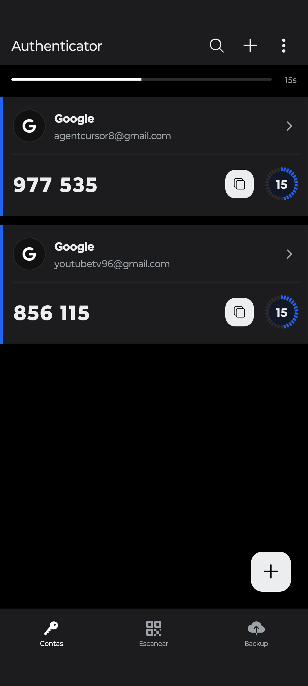
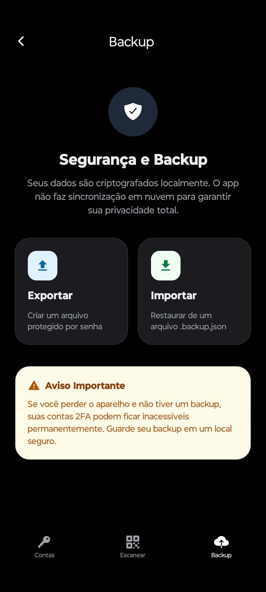

# 🛡️ Authenticator

<p align="center">
  
</p>

Uma solução de autenticação de dois fatores (2FA) moderna, segura e privada, construída com as tecnologias mais recentes do ecossistema **Expo** e **React Native**.

## ✨ Funcionalidades

- **🔒 Armazenamento de Hardware**: Seus segredos (seeds) são armazenados de forma segura utilizando criptografia em nível de hardware via `Expo SecureStore`.
- **🛡️ Proteção Biométrica**: Camada extra de segurança com suporte nativo a **Face ID** e **Impressão Digital** para desbloquear o app.
- **📦 Backups Criptografados**: Sistema robusto de exportação e importação utilizando criptografia `AES-256-GCM` com derivação de chave `PBKDF2-SHA256` (210.000 iterações).
- **📷 Scanner de QR Code**: Adicione novas contas instantaneamente através da câmera.
- **⌨️ Entrada Manual**: Suporte total para configuração manual de contas com ajustes finos de algoritmos (SHA1, SHA256, SHA512), número de dígitos e período de renovação.
- **🌗 Interface Adaptativa**: Suporte completo a temas Claro e Escuro, seguindo as preferências do sistema.
- **🧩 Gestão de Contas**: Edite nomes de emissores e usuários, ou remova contas com facilidade.

## 📱 Capturas de Tela

<p align="center">
  
  
  
  
</p>

## 🛠️ Tecnologias

- **Core**: [React Native 0.81](https://reactnative.dev/) & [Expo 54](https://expo.dev/)
- **Navigation**: [Expo Router](https://docs.expo.dev/router/introduction/) (File-based routing)
- **Cryptography**: `@noble/ciphers` & `expo-crypto`
- **TOTP**: `otplib`
- **UI/UX**: React Native Reanimated, Expo Symbols (iOS) & Material Icons (Android)

## 🚀 Como Começar

### Pré-requisitos

- Node.js (v18 ou superior)
- npm ou yarn
- [Expo Go](https://expo.dev/go) instalado no seu dispositivo móvel

### Instalação e Execução

1. **Clone este repositório**
   ```bash
   git clone https://github.com/seu-usuario/authenticator.git
   cd authenticator
   ```

2. **Instale as dependências**
   ```bash
   npm install
   ```

3. **Inicie o servidor de desenvolvimento**
   ```bash
   npx expo start
   ```

4. **Abra o aplicativo**
   - Escaneie o QR Code exibido no terminal com o app **Expo Go** (Android) ou a **Câmera** (iOS).

## 🔒 Segurança & Privacidade

O **Authenticator** foi desenhado com a privacidade como prioridade máxima:
- **Offline por Padrão**: Nenhum dado ou segredo é enviado para a nuvem. O app não possui serviços de tracking ou analytics.
- **Segurança de Dados**: Backups utilizam padrões criptográficos da indústria para garantir que, mesmo se o arquivo for interceptado, seus dados permaneçam inacessíveis sem a senha.

---
Desenvolvido com foco em segurança e performance.
